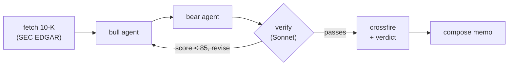

# Verity

**Equity research you can verify.** A multi-agent system built on LangGraph where a
bull and a bear analyst debate a stock from its latest SEC filing, a verifier agent
scores every claim against the source, and the debate resolves into a neutral verdict.

Built as a hands-on study in agentic AI and product thinking: real filings, real
Claude agents, measured guardrails, and a small, polished product UI.

---

## The problem

LLM-written equity notes sound confident and quietly invent numbers. Verity's wedge is
**verifiability**: nothing reaches the reader unchecked. A dedicated verifier agent reads
the same filing and flags any claim whose facts or figures do not appear in the source,
then reports a grounding score. If too many claims are unsupported, the theses are sent
back for a rewrite before you ever see them.

## How it works

The pipeline is a LangGraph `StateGraph` with a self-correcting loop:



- **fetch** – pull the latest 10-K from SEC EDGAR (free), extract Business / Risk Factors / MD&A.
- **bull / bear** – two Claude (Haiku) analysts each write a grounded thesis from the same filing.
- **verify** – a Claude (Sonnet) fact-checker scores what fraction of claims are supported by the
  filing. Below threshold, it loops the theses back with feedback (self-correction).
- **crossfire + verdict** – the two sides rebut each other's single strongest point, then the debate
  resolves into a neutral verdict: the central tension, what each side needs to be right, and the one
  metric to watch. This is analysis, not investment advice.
- **compose** – assemble the final memo.

## Does it actually work? (evals)

Two eval harnesses, with real numbers.

**Verifier catch-rate** (`adversarial_eval.py`) — hand-labeled banks of real vs. fabricated claims
fed to the verifier:

| Model | Fabrications caught | False positives |
|-------|--------------------:|----------------:|
| Claude Haiku 4.5 | 89% | 0% |
| Claude Sonnet 5  | **100%** | **0%** |

**Memo quality** (`eval.py`, LLM-as-judge, 1–5): averages 3–4/5 across companies, strong on
specificity and clarity. Grounding scores on the sample set run 88–97/100.

## Tech

- **Backend:** FastAPI, LangGraph, Anthropic Claude (Haiku for drafts, Sonnet for the verifier),
  SEC EDGAR, prompt caching, and Server-Sent Events for live pipeline progress.
- **Frontend:** React + Vite + React Router, live market quotes, and a custom dark UI.
- **Cost discipline:** model tiering (cheap draft, strong verifier), prompt caching of the shared
  filing block, and result caching so repeat views are instant and free.

## Run it locally

**Backend** (Python 3.12):

```
cd backend
python -m venv .venv && .venv/Scripts/activate    # Windows; use source .venv/bin/activate on macOS/Linux
pip install -r requirements.txt
cp .env.example .env        # then add your ANTHROPIC_API_KEY
python -m uvicorn api:app --port 8001
```

**Frontend:**

```
cd frontend
npm install
npm run dev                 # http://localhost:5173
```

## Deploy

See [DEPLOY.md](DEPLOY.md) — frontend on Vercel, backend on Render, both from this repo.

## Safety and cost

- The Anthropic key lives only server-side (never in the frontend).
- Per-IP rate limiting and a daily cap on new analyses protect against a runaway bill.
- Cached views are free and do not count against the cap.

## Disclaimer

Verity generates research for education, not investment advice. It is not a licensed advisor and
does not tell you to buy, sell, or hold anything.
